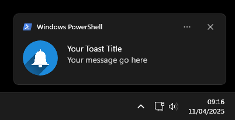

# MQTT Topic to Windows Toast Notification

A simple Rust application that connects to an MQTT broker and listens to a topic. It creates Windows notifications from JSON messages sent to that topic.

## How it works

A tray application is initiated on a Windows machine. The app connects to an MQTT server and listens for messages following a specific JSON format. When a message matching the format is received, it creates a Windows Toast notification.



## Json Format
JSON message format:
```
{
  "title": "Your Toast Title",
  "body_message": "Your message go here",
  "logo": null,
  "message_id": "some_UID"
}
```

| **Field**      | **Type** | **Description**                                                                                                                                     |
| -------------- | -------- | --------------------------------------------------------------------------------------------------------------------------------------------------- |
| `title`        | `String` | The title text displayed in the toast notification.                                                                                                 |
| `body_message` | `String` | The main content or message body of the toast notification.                                                                                         |
| `logo`         | `String` | _(Optional)_ The filename of a logo image located in the `images/` directory.  <br>If not provided or empty, `default_toast_logo.png` will be used. |
| `message_id`   | `String` | A unique identifier used to prevent displaying duplicate notifications.                                                                             | 

Example:
```
{
  "title":"Coffee Break",
  "body_message":"Time to relax and have a coffee.",
  "logo":"coffee.png",
  "message_id":"id202501301500"
}
```

## config.json
Add username and password if required.

```
{
    "mqtt_server": "192.168.15.101",
    "mqtt_port": 1883,
    "mqtt_username": null,
    "mqtt_password" : null,
    "mqtt_topic": "hello/world",
    "cleaning_cycle": 3600
}
```

| **Field**        | **Type** | **Description**                                                                                      |
| ---------------- | -------- | ---------------------------------------------------------------------------------------------------- |
| `mqtt_server`    | `String` | The address of the MQTT server.                                                                      |
| `mqtt_port`      | `int`    | The port number used to connect to the MQTT server.                                                  |
| `mqtt_username`  | `String` | _(Optional)_ Username for authenticating with the MQTT server.                                       |
| `mqtt_password`  | `String` | _(Optional)_ Password for authenticating with the MQTT server.                                       |
| `mqtt_topic`     | `String` | The MQTT topic to subscribe to for receiving messages.                                               | 
| `cleaning_cycle` | `int`    | Interval in seconds (e.g., `43200` for 12 hours) to clear cached `message_id`s and avoid duplicates. |


# Folders & Files

```
Folder/
    ├── images/
    |   ├── notificationlogo.png
    │   └── **place your logos here**
    ├── config/
    │   └── config.json
    └── win_mqtt_notify.exe
```
| file                   | description                                      |
| ---------------------- | ------------------------------------------------ |
| default_toast_logo.png | Default logo used by Windows Toast Notification  |
| config.json            | MQTT servers configurations                      |
| win_mqtt_notify.exe    | the application                                  | 


## Windows Startup

Add the app to Windows startup so the server is loaded automatically on start.

```
%AppData%\Microsoft\Windows\Start Menu\Programs\Startup
```

## License ##

[](https://creativecommons.org/publicdomain/zero/1.0/)

This project is in the worldwide [public domain](LICENSE).

This project is in the public domain and copyright and related rights in the work worldwide are waived through the [CC0 1.0 Universal public domain dedication](https://creativecommons.org/publicdomain/zero/1.0/).

All contributions to this project will be released under the CC0 dedication. By submitting a pull request, you are agreeing to comply with this waiver of copyright interest.